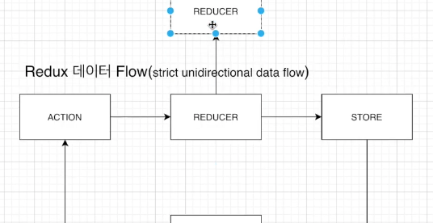

## nodeJS 란 무엇인가? 
1. Node.js is an open-source, cross-platform, JavaScript runtime environment that executes JavaScript code outside of a browser
2. ExpressJS is a framework of nodeJS

## MongoDB 
1. Model은 스키마를 감싸주는 역할 
2. Schema는 관계형 데이터베이스의 하나의 테이블이라고 생각하면 될듯  

## Git 
```
git add --all 
git commit -m "처음 저장소에 올림"
git branch -M naster
git remote add origin https://github.com/dusrbpoiiij/WEB-boiler_plate.git
git push -u origin master
```

## NPM vs NPX 
1. NPM : Node Package Manager 
2. NPX : npm registry에서 create-react-app을 찾아서 다운로드 없이 실행시켜 준다. 
  ㄴ 항상 최신버전을 사용할 수 있다.
  ㄴ Disk 낭비가 없다. 

## Props vs State 
1. Props 
- 부모 컴포넌트 -> 자식 컴포넌트로 이동 
- 변경 불가능 
2. State 
- 컴포넌트 안에서 data를 전달하려면 State 사용 
- 변경 가능 
- State가 변하면 re-render 

## Redux 
1. State의 상태를 관리
2. 컴포넌트 내에서 데이터 변경 -> Store에 저장 -> 다른 컴포넌트로 뿌려줄 수 있음 
